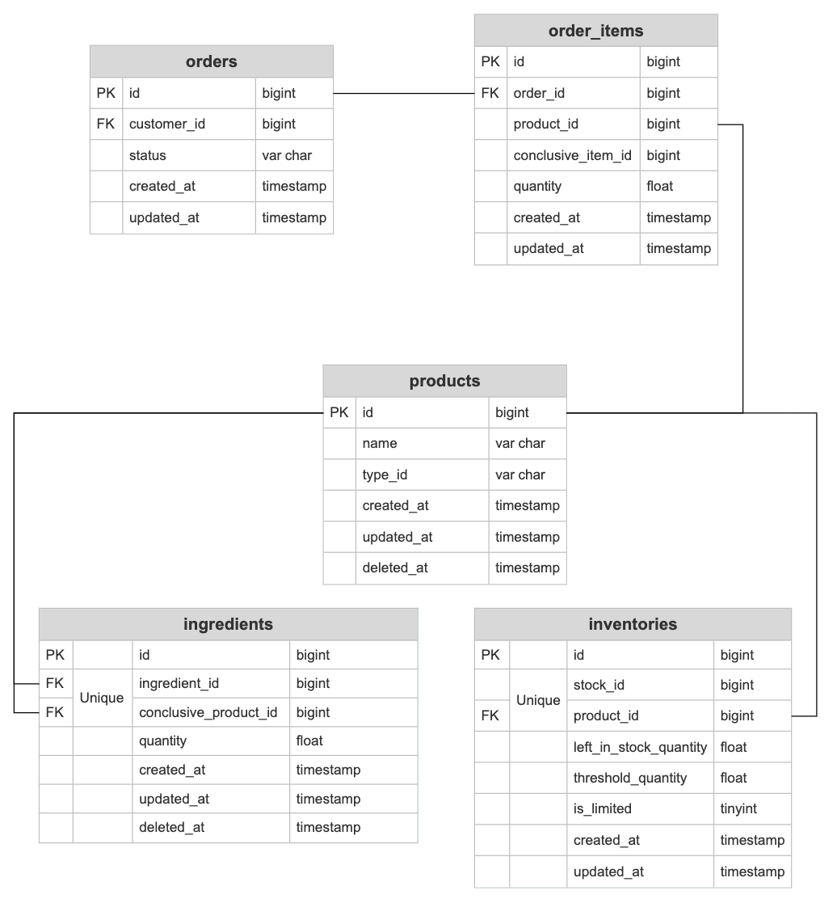

<p align="center"><a href="https://laravel.com" target="_blank"></a></p>

<p align="center">
<a href="https://github.com/laravel/framework/actions"></a>
<a href="https://packagist.org/packages/laravel/framework"></a>
<a href="https://packagist.org/packages/laravel/framework"></a>
<a href="https://packagist.org/packages/laravel/framework"></a>
</p>

# Inventory Management System

## User Guide

### Description

This system allow customers to place orders, when a customer makes an order that includes a specific product the system will update the stock of each of the ingredients so it reflects the amounts consumed.

Also when any of the ingredients stock level reaches 50%, the system should send an email message to alert the merchant they need to buy more of this ingredient.

The system accepts two types of products: compound product ex: Burger not an ingredient product ex: onion.

### Usage

The module is used to :
1 - Authenticate customers while checking out.
2 - Store customers' orders along with each order if.
3 - Update stock of each product after placing orders.
4 - Send email to seller incase any ingredient stock level reached 50%.

## Implementation Guide

### Configuration

* Configure seller data including.
  * SELLER_NAME.
  * SELLER_EMAIL.
* Configure DEFAULT_STOCK_ID to specify a stock to be used during placing orders.
* Configure _TOKEN used during customers authentication.

### Installation

Migrate data using ``php artisan migrate``
Then seed the database ``php artisan db:seed``
To run tests use ``composer tests``

### Database Structure
The database consists of 5 main models: Product - Ingredient - Inventory - Order - Order Item.



### API Documentation / Consumers' Guide
1) Creating Order.
    - Endpoint: APP_URL/api/orders;
    - Method: POST
    - Headers: 
    ```php
    {
        'Authorization'=>'Bearer '.$token,
        'Accept' => 'application/json'
    }
    ```
    - Body: 
    ```php
    {
    "products": [
        {
            "product_id": 4,
            "quantity": 3
        },
        {
            "product_id": 3,
            "quantity": 40
        }
        ] 
    }
    ```
    - Restrictions: 
      1) ```products``` attribute is required.
      2) ```product_id quantity``` are also required for each product.
      3) The first product should always be a compound product.

## Testing Guide

Those are the tested features:

* RegistrationTest
    * test_required_name_for_registration
    * test_required_email_for_registration
    * test_valid_format_email_for_registration
    * test_unique_email_for_registration
    * test_required_password_for_registration
    * test_required_confirm_password_for_registration
    * test_wrong_confirm_password_for_registration
    * test_user_registration_successfully
    
* LoginTest
    * test_required_email_for_login
    * test_valid_format_email_for_login
    * test_required_password_for_login
    * test_user_login_fails_on_wrong_credentials
    * test_user_login_successfully
    
* LogoutTest
    * test_user_logout_failed
    * test_user_logout_successfully

* OrderTest
    * test_failed_placing_order_for_unauthorized_users
    * test_required_products_for_placing_order
    * test_required_product_id_for_placing_order
    * test_exist_product_id_for_placing_order
    * test_required_quantity_for_placing_order
    * test_numeric_quantity_for_placing_order
    * test_gth_zero_quantity_for_placing_order
    * test_order_item_type_rule_for_placing_order
    * test_placing_order_successfully

* OrderItemTest
    * test_order_item_creation_for_both_types_of_products

* InventoryTest
    * test_placing_order_fails_for_out_of_stock_items
    * test_sending_email_when_inventory_reaches_50_Percent
    * test_ingredient_products_stock_size_on_placing_order